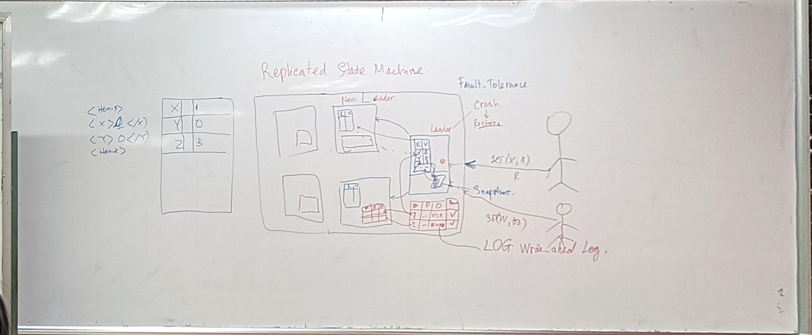

# Distributed Systems

This is the repo of Distributed Systems course

## Lecture 01
[How to Write Go Code](https://go.dev/doc/code#:~:text=Go%20programs%20are%20organized%20into,files%20within%20the%20same%20package.)

## Lab01

## Lecture 02

## Lab02
[rpc](https://pkg.go.dev/net/rpc)
[lab02 submit link](https://docs.google.com/forms/d/e/1FAIpQLSfCGAMuYYLqXx6jTMc3Fmx5dyTD5aJIQPshe8XjIMaf3YvZlw/viewform)
## Lecture 03

## Lab03

## Lecture 04

Các server phân biệt với nhau bằng IP (và port)

Trong key-value store, thêm phần replication vào. Mỗi lần user set giá trị vào bảng key-value khi put dữ liệu lên, ta cần copy dữ liệu qua các server còn lại (giả sử là 5 server)

Các test cases:
- TC_01: Put/get
- TC_02: Put/get when primary is dead
- TC_03: put and get in slow network 

hàm ping để kiểm tra primary server còn sống

tất cả các server tự gửi cho nhau bằng hàm check để lấy một cặp ip-version, chờ vài chục giây -> chọn version cao nhất và ip thấp nhất làm primary mới nếu primảy hiện tại chớt

các máy phải lưu primary_ip, có biến isPrimary

Deadline: 16h00 18/08/2023

Link: https://docs.google.com/forms/d/e/1FAIpQLSdc2hOqxAeM4oY5JvTxe8kG6YGj67zF27OcAZXZI236IFFkew/viewform

## 220823
## Fault Tolerance

Chọn ông leader

- nếu leader chớt (crash) thì dữ liệu của nó đi đâu về đâu? -> dữ liệu store trên ram sẽ mất hoàn toàn -> chọn new leader

- nếu đã chớt mà sống lại (restore) -> liên hệ new leader để copy dữ liệu sang -> không khả thi trong thực tế vì mấy ngàn server, dữ liệu rất lớn -> lưu dữ liệu về local định kỳ (snapshot) (không lưu ram như ở trên) -> thiếu nhiêu thì mới bắt đầu hỏi new leader để copy qua

các cách một dev lưu hashtable vào file/database:
- value<khoảng trắng>key
- cứ x-byte đọc thành 1 giá trị
- lưu dạng xml
- lưu dạng json

làm sao để biết file của leader vừa chớt và new leader khác nhau chỗ nào =))
- lưu hành động của client bằng một cái file (write_head_log file)

| thứ tự | operation | operation | process|
|--------|-----------|-----------|--------|
|   1    |    _      |  x=1      |  v     |
|   2    |    -      |  w=2      |  x     |

Các server đều có một file log, khi có vấn đề xảy ra, ta chỉ cần copy các dòng thiếu của các file log với nhau

Replicated State Machine: 
Ý tưởng là làm ra một hệ thống không bao giờ chớt -- trách nhiệm không bao giờ chớt (luôn có người chịu trách nhiệm)

Ref:
- https://github.com/eliben/raft
- https://eli.thegreenplace.net/2020/implementing-raft-part-0-introduction/
- https://raft.github.io/

Quy tắc vote:
- lượng phiếu bầu lớn hơn 50% thì thắng
- nếu số phiếu bằng nhau -> vote lại
- mỗi người dc vote một lần
- nếu một người vận động (A) một người khác (B) mà người đó (B) chưa vote cho ai thì phải vote cho người vận động (A)
- term và length(log) phải lớn hơn mỗi server khác đang xét

- election timer (các timer này tại khác server và set thời gian lặp khác nhau, vd: *0.001*(timer reset của leader--ping timer)-1-2-3-5-7-10)
    - nếu timer vừa hết mà chưa bầu ai, thì bầu cho mình và gửi request tới những người khác bầu cho mình
    - khi đã bầu thì reset timer để chạy lại từ đầu
    - leader có 2 timer, một election, một để reset timer các timer của các server khác

Một server có 3 trạng thái
- follower - khi vừa start, và có election timer 
- candidate - khi election timer vừa hết
- leader - khi nhận được nhiều hơn 50% phiếu bầu, bắt đầu start ping timer (timer này ngắn, vd: 15s)

Trường hợp leader không chớt mà chỉ disconnect, khi đó, nó không restart để trở thành follower lại mà vẫn giữ trạng thái leader 
- dùng cơ chế safety: lưu lại nhiệm kỳ (term)
mỗi election timer hết thì cập nhật term thêm 1 đơn vị,

tất cả request sẽ đi kèm với term, nếu term nhỏ hơn thì hoy nghỉ chơi :'> 

leader cũ khi gặp request ping timer có term lớn hơn bản thân -> trở thành follower, bỏ ping timer đang có

số server nên là 2f+1 để có số lượng vote có thể đạt được max là f+1, 

số server được phép down là f, khi số server down vượt qua số lượng này, hệ thống đứng im, không làm gì nữa cả, tránh trường hợp sai sót

ping timer phải đủ nhỏ để tránh các server khác bầu liên tục gây lãng phí (nên nhỏ hơn thằng nhỏ nhất???)

membership change using timer machinism, length(log) và term - RAFT

ta chỉ cần replicate lại f+1 cái trên tổng số 2f+1 server là đã có thể trả lời cho client là đã thành công

| primary                             |   leader  |
|-----------                          |-----------|
|người replicate dữ liệu dưới database| người phân quyền, không bao giờ chớt|

- cơ chế liveness

Cả hai phương pháp RAFT và PAXOS đều giải quyết bài toán 
|RAFT       | PAXOS     |
|---        |---        |
|chứng minh một phần trong bài báo, dễ hiểu =))|được toán học chứng mình và công nhận đồ, khó hiểu, khó implement, mặc dù đã được [google spanner](https://cloud.google.com/spanner/docs/replication), microsoft implement |
|dùng 2 timer: ping và election | dùng timer nhưng dùng kiểu khác |

### Giới thiệu Lab04
Chỉnh lại 2 con số timer (15s vs 300s chỉnh thành 2 số khác thử) để chạy lại mã nguồn và hiểu dc source

16h00, 23/08/2023
https://docs.google.com/forms/d/e/1FAIpQLSdlwRRDMkdRRVjl30ijyV1OpfzXjagWRmaFv3Jgi9IG_VTFLg/viewform

https://github.com/eliben/raft/tree/master/part1

Ý tưởng: ông leader luôn có log ukie nhất, có cơ chế gửi đến các follower nội dung client request 

mỗi log đi kèm term 

khi leader gửi log mới và record log ngay phía trước tới mỗi server, mỗi server sẽ thực hiện so sánh record ngay trước với record cuối của mình xem trùng không, nếu trùng thì ngon :v

trường hợp không trùng, follower response lại là not match, leader gửi lại 2 record trước và log mới, và server nhận được lại tiếp tục so sánh, hành động này được lặp lại cho đến khi gặp được dòng trùng và chèn hết cái nùi mới nhận mà trùng dô

leader không được phép thay đổi log của mình, follower thì được phép thay đổi.

